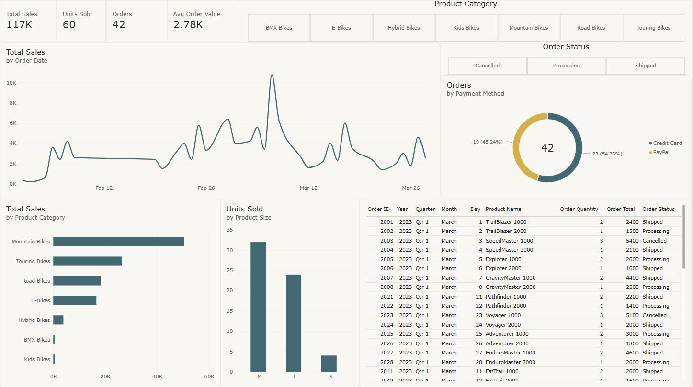

# 🚲 Bike Sales Performance Dashboard (Power BI)

An interactive Power BI dashboard that turns raw bike-shop order data into clear sales insights: revenue trends, top categories, order status, and payment behavior.

Built as the hands-on project for the Microsoft course **[Harnessing the Power of Data with Power BI](https://coursera.org/verify/YNTE9VEL30MQ)** (Coursera, grade 90%).



## 📌 Key Insights

| KPI | Value |
|---|---|
| Total Sales | **$117K** |
| Units Sold | **60** |
| Orders | **42** |
| Avg Order Value | **$2.78K** |

*KPIs exclude cancelled orders (6 of 48 orders, ~$30.9K).*

- **Mountain Bikes lead revenue** (~$50.4K), followed by Touring Bikes (~$26.5K) and Road Bikes (~$18.4K).
- **Medium (M) is the best-selling size** with 32 units, then L (24) and S (4).
- **Payments split ~55% PayPal / 45% Credit Card** across the 42 orders.
- Sales show clear spikes across Feb-Mar 2023, with one peak day around 10K.

## 🧰 Tools & Skills

- **Power BI Desktop**: data modeling, DAX measures, interactive visuals, slicers
- **Power Query**: data cleaning and transformation
- **Python (pandas)**: reproducible cleaning script
- **Data storytelling**: KPI cards, trend, category and status analysis

## 🧹 Data Cleaning

The raw export had several quality issues, fixed before modeling:

| Issue | Fix |
|---|---|
| Semicolon-delimited file | Re-parsed with the correct delimiter |
| 13 spellings of 7 categories (`Mountain BIKES`, `road Bikes`, ...) | Standardized to proper case |
| Mixed-case sizes (`m`, `L`, `s`) | Standardized to `S / M / L` |
| Leading/trailing spaces in product names | Trimmed |
| Missing subcategory / description | Filled with `Not Specified` / `Description Not Available` (0 nulls in the clean file) |

Run the cleaning script yourself:

```bash
pip install -r requirements.txt
python scripts/clean_sales_data.py
```

## 📊 Dashboard Contents

- **KPI cards**: Total Sales, Units Sold, Orders, Average Order Value
- **Total Sales by Order Date**: daily revenue trend (line chart)
- **Orders by Payment Method**: Credit Card vs PayPal (donut chart)
- **Total Sales by Product Category** (bar chart)
- **Units Sold by Product Size** (column chart)
- **Order details table** with drill-down
- **Slicers**: Product Category and Order Status

## 📁 Repository Structure

```
bike-sales-powerbi-dashboard/
├── dashboard/
│   └── Bike_Sales_Performance_Dashboard.pbix
├── data/
│   ├── raw/bike_sales_raw.csv
│   └── processed/bike_sales_clean.csv
├── scripts/
│   └── clean_sales_data.py
├── docs/images/
│   ├── dashboard-preview.png
│   └── coursera-certificate.png
├── requirements.txt
├── LICENSE
└── README.md
```

## ▶️ How to Use

1. Clone the repo: `git clone https://github.com/ali-essam2002/bike-sales-powerbi-dashboard.git`
2. Open `dashboard/Bike_Sales_Performance_Dashboard.pbix` in **Power BI Desktop**.
3. If prompted, point the data source to `data/processed/bike_sales_clean.csv` (Transform data → Data source settings).

## 🎓 Certification

**Harnessing the Power of Data with Power BI**, Microsoft (via Coursera), Sep 28, 2026.
[Verify certificate](https://coursera.org/verify/YNTE9VEL30MQ)


## 👤 Author

**Ali Essam Abdelhakeem**
[GitHub](https://github.com/ali-essam2002) · [LinkedIn](https://www.linkedin.com/in/YOUR-LINKEDIN)

